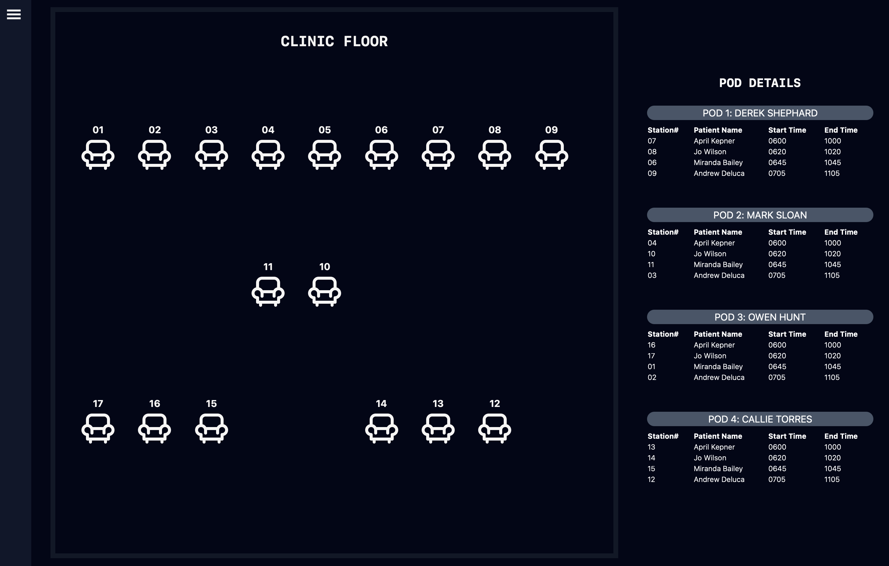

# PrioritizeQ

Time management is crucial in healthcare professional workflows, especially nurses.
With burnouts running rampant in the healthcare settings, building a software that aid in workflow would help tremendously.
- The application, PrioritizeQ, provides a quick visual understanding of how a clinic is laid out along with where patients are seated.
Every clinic layout is different, so by providing a visual aid, nurses unfamiliar to the clinic become quickly tuned into the clinic layout.

Overseeing the care of 12+ patients per shift means multitasking. 
- PrioritizeQ helps nurses with the prioritization of patients based on the time patient is scheduled to start treatment. 
- Visualization, quick access to heavily utilized specific patient data and patient checklist are components of the application that would make for a more efficient workflow.

